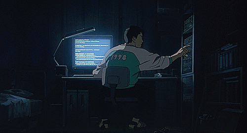
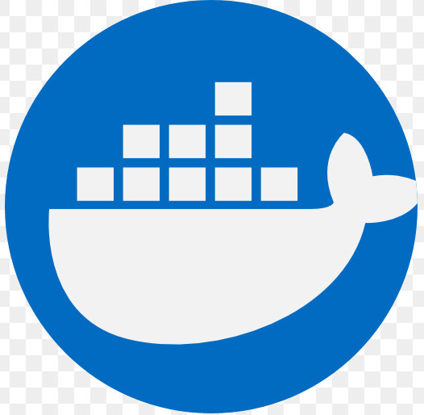
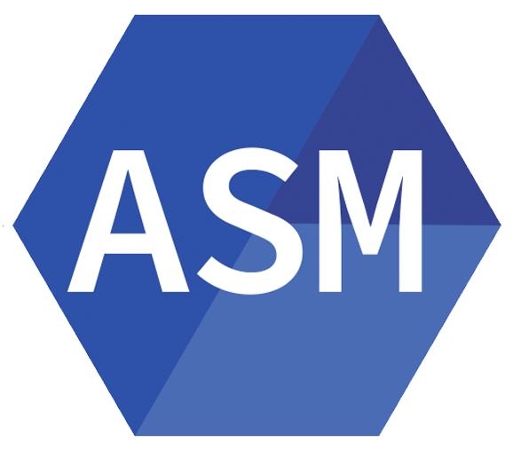

# print('Hi there, My name is Tarek👋🏼')  

<picture>
  <source media="(prefers-color-scheme: light)" srcset="./img/totorocart.gif">
  
</picture>

~~- 🌱 I'm currently studying computer science [3/3].~~  
- 🛡️ I'm currently working at Sopra Steria with cybersecurity since August 2024 
- 🔭 Currently exploring: Advanced Penetration Testing techniques

<picture>
  <source 
    media="(prefers-color-scheme: dark)"
    srcset="https://github-readme-stats.vercel.app/api/wakatime?username=TrakeLean&v=2&show_icons=true&hide_border=true&theme=dark&layout=compact&langs_count=5"
  />
  <source
    media="(prefers-color-scheme: light)"
    srcset="https://github-readme-stats.vercel.app/api/wakatime?username=TrakeLean&v=2&show_icons=true&hide_border=true&theme=default&layout=compact&langs_count=5"
  />
  
</picture>

---

### Languages and Tools:

<picture>
  <source media="(prefers-color-scheme: light)" srcset="https://cdn.jsdelivr.net/gh/devicons/devicon/icons/github/github-original.svg">
  
</picture>

<picture>
  <source media="(prefers-color-scheme: light)" srcset="./img/darklatex.png">
  
</picture>

 
 

### Skills:

  
:zap: Language Stats

<picture>
  <source media="(prefers-color-scheme: light)" srcset="https://github-readme-stats.vercel.app/api/top-langs/?username=trakelean&layout=compact&show_icons=true&hide_border=true&title_color=000000&icon_color=f05237&bg_color=f7f7f7&text_color=000000&border_color=0c1a25">
  
</picture>

---

### GitHub Stats:

<picture>
  <source media="(prefers-color-scheme: light)" srcset="https://github-readme-stats.vercel.app/api?username=TrakeLean&show_icons=true&hide_border=true&title_color=000000&icon_color=f05237&bg_color=f7f7f7&text_color=000000&border_color=0c1a25">
  
</picture>

 

---

### Featured Projects:

---

### Connect with me:

&nbsp;&nbsp;

&nbsp;&nbsp;

&nbsp;&nbsp;

---

 

<!-- 512 -->
<!-- [youtube]: https://www.youtube.com/watch?v=EdXjLVVa3no
[instagram]: https://www.instagram.com/Sjeikentarak
[linkedin]: https://www.linkedin.com/in/tarek-lein-976446225/ -->
